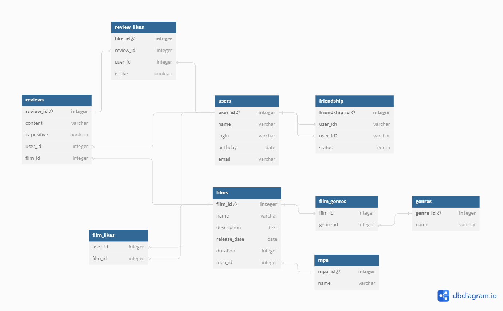

# java-filmorate

## [ER-diagram](https://dbdiagram.io/d/656a005e56d8064ca0356fac)




#### Получить всех пользователей
```sql
SELECT *
FROM users
```
---

#### Получить друзей пользователя c id=3
```sql
SELECT u.user_id,
u.name,
u.login,
u.birthday,
u.email
FROM friends AS f
JOIN users AS u ON f.user_id2 = u.user_id
WHERE f.user_id1 = 3
UNION
SELECT *
FROM friends AS f
JOIN users AS u ON f.user_id1 = u.user_id
WHERE f.userID2 = 3;
```
---

#### Получить общих друзей между пользователями id=1 и id=3
```sql
SELECT DISTINCT u.user_id,
u.name,
u.login,
u.birthday,
u.email
FROM friends AS f1
JOIN friends AS f2 ON f1.user_id2 = f2.user_id2
JOIN users AS u ON F1.user_id2 = u.user_id
WHERE f1.user_id1 = 1 AND f2.user_id1 = 3
   OR f1.user_id1 = 3 AND f2.user_id1 = 1;
```
---

#### Получить топ 100 пользователей по кол-ву друзей
```sql
SELECT u.user_id,
u.name,
u.login,
u.birthday,
u.email, 
COUNT(*) AS friends_count
FROM users u
LEFT JOIN friends f ON u.user_id = f.user_id1 OR u.user_id2 = f.User_id2
GROUP BY u.user_id
ORDER BY FriendCount DESC
LIMIT 100;
```
---

#### Получить фильмы со строкой "форсаж" входящей в название
```sql
Select f.film_id, 
f.name,
f.description
f.release_date,
f.duration,
f.MPA
FROM films AS f
WHERE f.name LIKE '%форсаж%'
```
---

#### Получить фильмы с жанром "Боевик" и "Гонки"
```sql
Select f.film_id, 
f.name,
f.description
f.release_date,
f.duration,
f.MPA
FROM films AS f
JOIN film_genres AS fg ON f.film_id = fg.film_id
JOIN genre AS g ON fg.genre_id = g.genre_id
WHERE g.name = 'Боевик' AND g.name = 'Гонки'
```
---

#### Получить топ 10 фильмов по количеству лайков
```sql
SELECT f.film_id, 
f.name,
f.description
f.release_date,
f.duration,
f.MPA,
COUNT(fl.user_id) AS likes_count
FROM films_likes fl
JOIN films f ON fl.film_id = f.film_id
GROUP BY f.film_id
ORDER BY like_count DESC
LIMIT 10;
```

#### Получить жанры у фильма с id=3
```sql
SELECT g.name
FROM genre AS g
JOIN film_genres AS fg ON g.genre_id = fg.genre_id
WHERE fg.film_id = 3;
```

---
#### Получить фильмы с рейтингом G, PG и PG-13
```sql
SELECT f.film_id, 
f.name,
f.description
f.release_date,
f.duration,
f.MPA
FROM films AS f
JOIN film_genres AS fg ON f.film_id = fg.film_id
JOIN genre AS g ON fg.genre_id = g.genre_id
WHERE MPA = 'G' OR MPA = 'PG' OR MPA = 'PG-13'
```