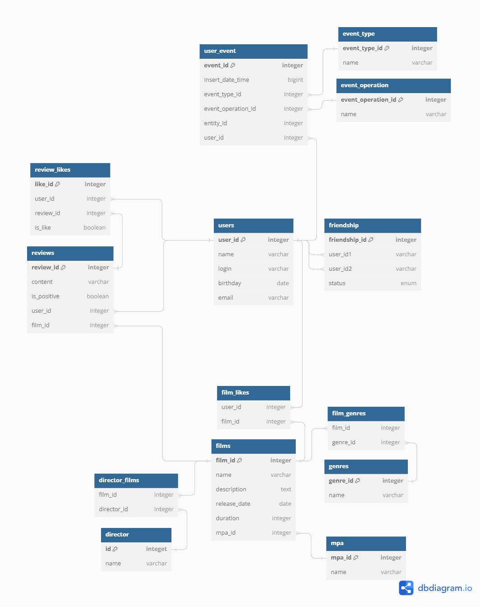

# java-filmorate

## Разработчики
1. **[Круглов Егор](https://github.com/EgorKruglov)**
    - Тимлид
    - "Рекомендации"
    - "Отзывы"

2. **[Фёдоров Илья](https://github.com/il86ff)**
    - "Лента событий"
    - "Удаление фильмов и пользователей"
    - "Общие фильмы"
    - "Вывод самых популярных фильмов по жанру и годам" (совместно с Игорем Шуровым)

3. **[Шуров Игорь](https://github.com/IgorShurov)**
    - "Поиск"
    - "Добавление режиссёров в фильмы"

4. **[Алероева Мадина](https://github.com/Madina-Aleroeva)**
    - Ревью кода

## [ER-diagram](https://dbdiagram.io/d/java-filmorate-version-1-656a005e56d8064ca0356fac)


#### Получить всех пользователей
```sql
SELECT *
FROM users
```
---

#### Получить друзей пользователя c id=3
```sql
SELECT u.user_id,
u.name,
u.login,
u.birthday,
u.email
FROM friendship AS f JOIN users AS u ON f.user_id2 = u.user_id
WHERE f.user_id1 = 3;
```
---

#### Получить общих друзей между пользователями id=1 и id=3
```sql
SELECT DISTINCT u.user_id,
u.name,
u.login,
u.birthday,
u.email
FROM friendship AS f1
JOIN friendship AS f2 ON f1.user_id2 = f2.user_id2
JOIN users AS u ON F1.user_id2 = u.user_id
WHERE f1.user_id1 = 1 AND f2.user_id1 = 3
OR f1.user_id1 = 3 AND f2.user_id1 = 1;
```
---

#### Получить топ 100 пользователей по кол-ву друзей
```sql
SELECT u.user_id,
u.name,
u.login,
u.birthday,
u.email, 
COUNT(*) AS friends_count
FROM users u
LEFT JOIN friends f ON u.user_id = f.user_id1 OR u.user_id2 = f.User_id2
GROUP BY u.user_id
ORDER BY FriendCount DESC
LIMIT 100;
```
---

#### Поставить лайк на фильм
```sql
INSERT INTO film_likes(user_id, film_id) +
VALUES (2, 10);
```
---

#### Получить фильмы со строкой "форсаж" входящей в название
```sql
Select f.film_id, 
f.name,
f.description
f.release_date,
f.duration,
f.MPA
FROM films AS f
WHERE f.name LIKE '%форсаж%';
```
---

#### Получить фильмы с жанром "Боевик" и "Гонки"
```sql
Select f.film_id, 
f.name,
f.description
f.release_date,
f.duration,
f.mpa_id
FROM films AS f
JOIN film_genres AS fg ON f.film_id = fg.film_id
JOIN genre AS g ON fg.genre_id = g.genre_id
WHERE g.name = 'Боевик' AND g.name = 'Гонки';
```
---

#### Получить топ 10 фильмов по количеству лайков
```sql
SELECT f.film_id, 
f.name, 
f.description, 
f.release_date, 
f.duration, 
f.mpa_id, 
COUNT(fl.user_id) AS likes_count 
FROM films f
LEFT JOIN film_likes fl ON fl.film_id = f.film_id 
GROUP BY f.film_id 
ORDER BY likes_count DESC NULLS LAST, f.release_date DESC 
LIMIT 10;
```

---
#### Получить все записи жанров фильма с id=3 с сортировкой по алфавиту 
```sql
SELECT * 
FROM genres AS g 
JOIN film_genres AS fg ON g.genre_id = fg.genre_id
WHERE fg.film_id = 3
ORDER BY g.genre_id ASC;
```